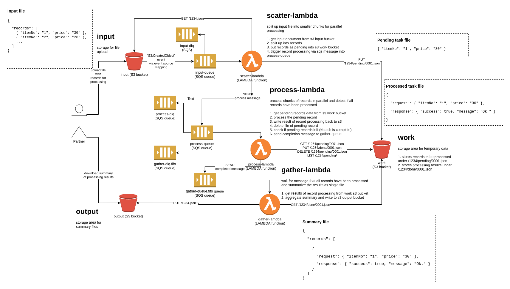
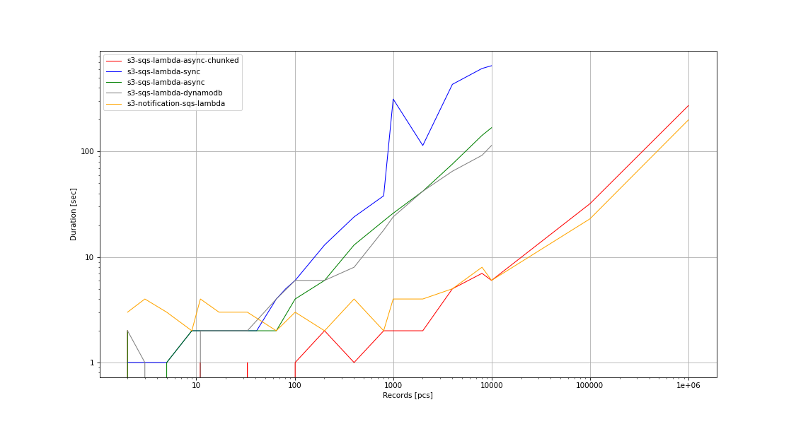

# Scatter gather with AWS lambda

## The challenge
Implement batch processing on AWS:

* Receive a single file of records to be processed via s3 upload
* Process records and update items in data store as parallel as possible
* Detect when all records have been processed
* Aggregate a result summary file in s3

## Prerequisites
* python 3.8
* GNU make
* docker
* [awscli](https://docs.aws.amazon.com/de_de/cli/latest/userguide/cli-chap-install.html)
* [tfvm](https://github.com/cbuschka/tfvm) or terraform
* [cw >= v3.3.0](https://github.com/lucagrulla/cw)

## Usage locally

### Start localstack, deploy and run benchmark
```
make clean start_localstack deploy benchmark report
```

### Stop and cleanup
```
make stop_localstack clean
```

## Usage on aws

All resources will be prefixed with your current ${USER}-. Pass
SCOPE=mycustomprefix- to make to override this default.

### Build, package, deploy run benchmark, report on measurements
```
make ENV=aws clean deploy_resources deploy_service benchmark report
```

### Undeploy
```
make ENV=aws destroy
```

### Variants
The task has been implemented in various variants:

* s3-sqs-lambda-sync (with boto3 blocking io)
* s3-sqs-lambda-async (with aioboto3 async io)
* s3-sqs-lambda-async-chunked (with aioboto3 async io, records packed into chunks)
* s3-sqs-lambda-dynamodb (with aioboto3 async io, records stored in dynamodb)

* s3-sqs-sfn (to come)
* s3-sqs-s3event (to come)
* glue?
* emr?
* spark?

### Results


[(Data)](./measurements.csv)

### Repository structure
* [infra](./infra) - Resources and service infrastructure
* [src](./src) - Service sources
* [tests](./tests) - Service tests
* [benchmark](./benchmark) - Benchmark sources

### Documentation
* [Learnings](./doc/learnings.md)
* [Links](./doc/links.md)
* [Troubleshooting](./doc/troubleshooting.md)

## License
Copyright 2020 by Cornelius Buschka. All rights reserved.

[Apache Public License 2.0](./license.txt)
